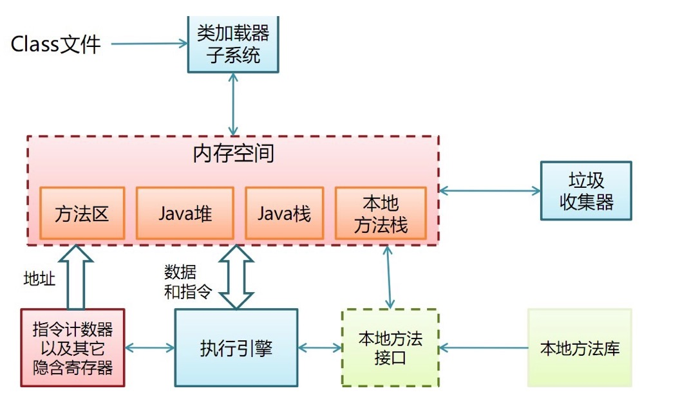
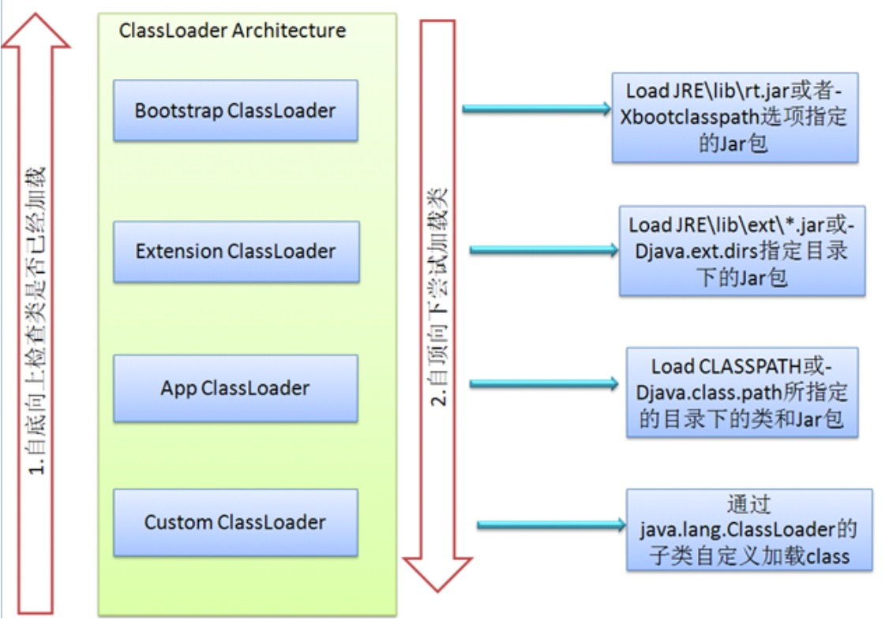

# JAVA虚拟机简介

##Java虚拟机定义

###Java虚拟机有多层含义

1. 一套规范：Java虚拟机规范。定义概念上Java虚拟机的行为表现
2. 一种实现：例如HotSpot，J9，JRockit。需要实现JVM规范，但具体实现方式不需要与“概念中”的JVM一样。
3. 一个运行中的实例,某个JVM实现的某次运行的实例.
4. 只要输入为符合规范的Class文件即可执行。并非一定要执行Java程序,可以支持其它语言，像Scala、Clojure、Groovy、Fantom、Fortress、Nice、Jython、 JRuby、Rhino、Ioke、Jaskell、（C、Fortran）

###JVM和JRE、JDK的关系
JVM：Java Virtual Machine，负责执行符合规范的Class文件。

JRE：Java Runtime Environment，包含JVM和类库。

JDK：Java Development Kit，包含JRE和一些开发工具，如javac。

###JVM实例和JVM执行引擎实例

JVM实例对应了一个独立运行的java程序，而JVM执行引擎实例则对应了属于用户运行程序的线程；也就是JVM实例是进程级别，而执行引擎是线程级别的。

### JVM的基本结构

### 类加载子系统
JVM的类加载是通过ClassLoader及其子类来完成的，类的层次关系和加载顺序可以由下图来描述：

1. 
Bootstrap ClassLoader负责加载$JAVA_HOME/jre/lib里所有的类库到内存，Bootstrap ClassLoader是JVM级别的，由C++实现，不是ClassLoader的子类，开发者也无法直接获取到启动类加载器的引用，所以不允许直接通过引用进行操作。

1. 
Extension ClassLoader负责加载java平台中扩展功能的一些jar包，主要是由    sun.misc.Launcher$ExtClassLoader实现的，是一个java类，继承自URLClassLoader超类。它将负责%JRE_HOME/lib/ext目录下的jar和class加载到内存，开发者可以直接使用该加载器。

1. 
App ClassLoader负责加载环境变量classpath中指定的jar包及目录中class到内存中，开发者也可以直接使用系统类加载器。

1. 
Custom ClassLoader属于应用程序根据自身需要自定义的ClassLoader(一般为java.lang.ClassLoader的子类)在程序运行期间，通过java.lang.ClassLoader的子类动态加载class文件，体现java动态实时类装入特性，如tomcat、jboss都会根据j2ee规范自行实现ClassLoader。自定义ClassLoader在某些应用场景还是比较适用，特别是需要灵活地动态加载class的时候。

