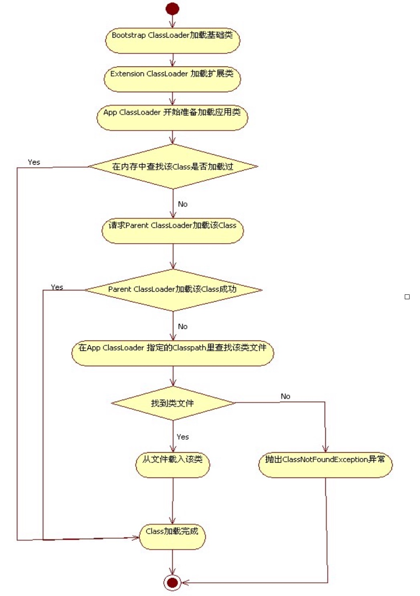

# 类加载器


```
public class ClassLoaderTest {
	public static void main(String[] args) {
		/**
		 * 我们无法获得引导类加载器，因为它是使用c实现的，而且使用引导类加载器加载的类通过getClassLoader 方法返回的是null. 所以无法直接操作引导类加载器，但是我们可以根据Class.getClassLoader 方法是否为null 判断这个类是不是引导类加载器加载的;但是我们可以通过下面的方法获得经由“引导类加载器”加载的类的路径(值得注意的是:每个jar包对应了一个URL)
		 */
		List<URL> list = Arrays.asList(sun.misc.Launcher.getBootstrapClassPath().getURLs());
		for(URL url : list){
			System.out.println(url.toString());
		}
	}
}
```
Output：
```
file:/D:/Program%20Files/Java/jdk1.6.0_13/jre/lib/resources.jar
file:/D:/Program%20Files/Java/jdk1.6.0_13/jre/lib/rt.jar
file:/D:/Program%20Files/Java/jdk1.6.0_13/jre/lib/sunrsasign.jar
file:/D:/Program%20Files/Java/jdk1.6.0_13/jre/lib/jsse.jar
file:/D:/Program%20Files/Java/jdk1.6.0_13/jre/lib/jce.jar
file:/D:/Program%20Files/Java/jdk1.6.0_13/jre/lib/charsets.jar
file:/D:/Program%20Files/Java/jdk1.6.0_13/jre/classes
```

从这个例子中我们可以看出Bootstrap ClassLoader加载的为$JAVA_HOME/jre/lib目录下的jar包。

Bootstrap ClassLoader、Extension ClassLoader、App ClassLoader三者的关系如下：Bootstrap ClassLoader由JVM启动，然后初始化sun.misc.Launcher，sun.misc.Launcher初始化Extension ClassLoader、App ClassLoader。Bootstrap ClassLoader是Extension ClassLoader的parent，Extension ClassLoader是App ClassLoader的parent。但是这并不是继承关系，只是语义上的定义，基本上，每一个ClassLoader实现，都有一个Parent ClassLoader。可以通过ClassLoader的getParent方法得到当前ClassLoader的parent。Bootstrap ClassLoader比较特殊，因为它不是java class所以Extension ClassLoader的getParent方法返回的是NULL。我们举下面的实例说明一下：

```
public class ClassLoaderTest2 {
	 public static void main(String[] args) {  
ClassLoader loader = Thread.currentThread().getContextClassLoader();  
System.out.println("current loader---->"+loader);  
	 System.out.println("parent loader-->"+loader.getParent());  
System.out.println("grandparent loader->"+loader.getParent().getParent()); 
		     }  
}
```
Output：
```
current loader---->sun.misc.Launcher$AppClassLoader@19821f
parent loader---->sun.misc.Launcher$ExtClassLoader@addbf1
grandparent loader---->null
```
了解了ClassLoader的原理和流程以后，我们可以试试自定义ClassLoader。关于自定义ClassLoader： 由于一些特殊的需求，我们可能需要定制ClassLoader的加载行为，这时候就需要自定义ClassLoader了.

自定义ClassLoader需要继承ClassLoader抽象类，重写findClass方法，这个方法定义了ClassLoader查找class的方式。

主要可以扩展的方法有：

* findClass          定义查找Class的方式
* defineClass        将类文件字节码加载为jvm中的class
* findResource       定义查找资源的方式 

如果嫌麻烦的话，我们可以直接使用或继承已有的ClassLoader实现，比如
java.net.URLClassLoader 
java.security.SecureClassLoader
java.rmi.server.RMIClassLoader
sun.applet.AppletClassLoader
Extension ClassLoader 和 App ClassLoader都是java.net.URLClassLoader的子类。
这个是URLClassLoader的构造方法：
public URLClassLoader(URL[] urls, ClassLoader parent)
public URLClassLoader(URL[] urls)
urls参数是需要加载的ClassPath url数组，可以指定parent ClassLoader，不指定的话默认以当前调用类的ClassLoader为parent。下面以一个例子加以说明：
Java代码1：

```
public class ClassWillBeLoaded {//这个类是要被装载的一个类(测试类).
	public static void main(String[] args) {
		ClassWillBeLoaded obj = new ClassWillBeLoaded();
	}
	public String doTask(String str1,String str2){
		return str1+" "+str2;
	}
	```
	
	
```
public class ClassLoaderTest3 {//使用反射机制调用通过URLClassLoader装载的类中的doTask方法
	public static void main(String[] args) throws MalformedURLException, ClassNotFoundException, SecurityException, NoSuchMethodException, IllegalArgumentException, IllegalAccessException, InvocationTargetException, InstantiationException {
		URL url = new URL("file:D:/share/ClassLoadTest.jar");
		URL[] urls = {url};
		ClassLoader classLoader = new URLClassLoader(urls);  
	Thread.currentThread().setContextClassLoader(classLoader);//设置该线程的上下文ClassLoader  
		Class clazz=classLoader.loadClass("classLoader.ClassWillBeLoaded");//使用loadClass方法加载class,这个class是在urls参数指定的classpath下边
Method taskMethod = clazz.getMethod("doTask", String.class, String.class);//然后我们就可以用反射做些事情了  
Object returnValue = taskMethod.invoke(clazz.newInstance(),"test","success");
		System.out.println((String)returnValue);
	}   }
```

要哪一个class loader加载呢？答案在于全盘负责委托机制，这是出于安全的原因。每次只要一个class被loaded，系统的class loader就首先被调用。然而它不会立即去load这个这个类。取而代之的是，他会把这个task委托给他的parent class loader，也就是extension class loader;同样的，extension class loader也会委托给它的parent class loader也就是bootstrap class loader。因此，bootstrap class loader总是被给第一个去load class的机会。如果bootstrap class loader找不到类的话，那么extension class loader将会load，如果extension class loader也没有找到对应的类的话，system class loader将会执行这个task，如果system class loader也没有找到的话，java.lang.ClassNotFoundException将会被抛出。另外一个原因是避免了重复加载类，每一次都是从底向上检查类是否已经被加载，然后从顶向下加载类，保证每一个类只被加载一次。



加载过程中会先检查类是否被已加载，检查顺序是自底向上，从Custom ClassLoader到BootStrap ClassLoader逐层检查，只要某个classloader已加载就视为已加载此类，保证此类只被所有ClassLoader加载一次。而加载的顺序是自顶向下，也就是由上层来逐层尝试加载此类。