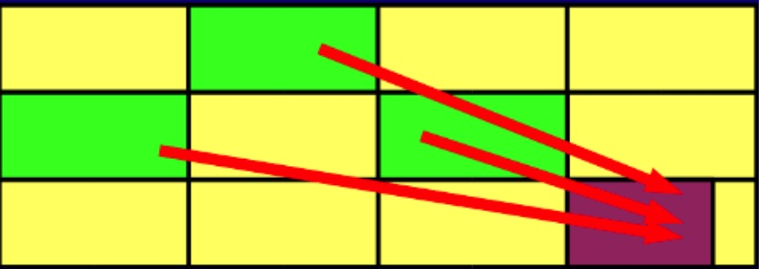

# Garbage First介绍
Garbage First简称G1，它的目标是要做到尽量减少GC所导致的应用暂停的时间，让应用达到准实时的效果，同时保持JVM堆空间的利用率，其最大的特色在于允许指定在某个时间段内GC所导致的应用暂停的时间最大为多少，例如在100秒内最多允许GC导致的应用暂停时间为1秒，这个特性对于准实时响应的系统而言非常的吸引人，这样就再也不用担心系统突然会暂停个两三秒了。

## 目标

从设计目标看G1完全是为了大型应用而准备的。

支持很大的堆

高吞吐量
* 支持多CPU和垃圾回收线程
* 在主线程暂停的情况下，使用并行收集
* 在主线程运行的情况下，使用并发收集

实时目标：可配置在N毫秒内最多只占用M毫秒的时间进行垃圾回收
当然G1要达到实时性的要求，相对传统的分代回收算法，在性能上会有一些损失。

## 算法详解

 G1可谓博采众家之长，力求到达一种完美。他吸取了增量收集优点，把整个堆划分为一个一个等大小的区域（region）。内存的回收和划分都以region为单位；同时，他也吸取了CMS的特点，把这个垃圾回收过程分为几个阶段，分散一个垃圾回收过程；而且，G1也认同分代垃圾回收的思想，认为不同对象的生命周期不同，可以采取不同收集方式，因此，它也支持分代的垃圾回收。为了达到对回收时间的可预计性，G1在扫描了region以后，对其中的活跃对象的大小进行排序，首先会收集那些活跃对象小的region，以便快速回收空间（要复制的活跃对象少了），因为活跃对象小，里面可以认为多数都是垃圾，所以这种方式被称为Garbage First（G1）的垃圾回收算法，即：垃圾优先的回收。
 
####回收步骤：
##### 1. 初始标记（Initial Marking）
G1对于每个region都保存了两个标识用的bitmap，一个为previous marking bitmap，一个为next marking bitmap，bitmap中包含了一个bit的地址信息来指向对象的起始点。

开始Initial Marking之前，首先并发的清空next marking bitmap，然后停止所有应用线程，并扫描标识出每个region中root可直接访问到的对象，将region中top的值放入next top at mark start（TAMS）中，之后恢复所有应用线程。

触发这个步骤执行的条件为：

G1定义了一个JVM Heap大小的百分比的阀值，称为h，另外还有一个H，H的值为(1-h)*Heap Size，目前这个h的值是固定的，后续G1也许会将其改为动态的，根据jvm的运行情况来动态的调整，在分代方式下，G1还定义了一个u以及soft limit，soft limit的值为H-u*Heap Size，当Heap中使用的内存超过了soft limit值时，就会在一次clean up执行完毕后在应用允许的GC暂停时间范围内尽快的执行此步骤；

在pure方式下，G1将marking与clean up组成一个环，以便clean up能充分的使用marking的信息，当clean up开始回收时，首先回收能够带来最多内存空间的regions，当经过多次的clean up，回收到没多少空间的regions时，G1重新初始化一个新的marking与clean up构成的环。

#####2.并发标记（Concurrent Marking）
按照之前Initial Marking扫描到的对象进行遍历，以识别这些对象的下层对象的活跃状态，对于在此期间应用线程并发修改的对象的以来关系则记录到remembered set logs中，新创建的对象则放入比top值更高的地址区间中，这些新创建的对象默认状态即为活跃的，同时修改top值。

#####3.最终标记暂停（Final Marking Pause）
当应用线程的remembered set logs未满时，是不会放入filled RS buffers中的，在这样的情况下，这些remebered set logs中记录的card的修改就会被更新了，因此需要这一步，这一步要做的就是把应用线程中存在的remembered set logs的内容进行处理，并相应的修改remembered sets，这一步需要暂停应用，并行的运行。

#####4.存活对象计算及清除（Live Data Counting and Cleanup）
 值得注意的是，在G1中，并不是说Final Marking Pause执行完了，就肯定执行Cleanup这步的，由于这步需要暂停应用，G1为了能够达到准实时的要求，需要根据用户指定的最大的GC造成的暂停时间来合理的规划什么时候执行Cleanup，另外还有几种情况也是会触发这个步骤的执行的：

G1采用的是复制方法来进行收集，必须保证每次的”to space”的空间都是够的，因此G1采取的策略是当已经使用的内存空间达到了H时，就执行Cleanup这个步骤；

对于full-young和partially-young的分代模式的G1而言，则还有情况会触发Cleanup的执行，full-young模式下，G1根据应用可接受的暂停时间、回收young regions需要消耗的时间来估算出一个yound regions的数量值，当JVM中分配对象的young regions的数量达到此值时，Cleanup就会执行；partially-young模式下，则会尽量频繁的在应用可接受的暂停时间范围内执行Cleanup，并最大限度的去执行non-young regions的Cleanup。
