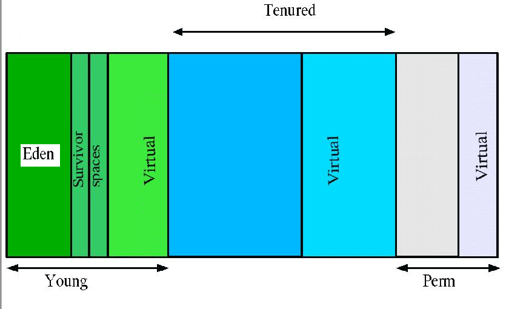

# 内存回收简介

Sun的JVM GC(垃圾回收)原理：把对象分为：年轻代(Young)、年老代(Tenured)、持久代(Perm)，对不同生命周期的对象使用不同的算法。(基于对对象生命周期分析)

1. Young（年轻代）
年轻代分三个区。一个Eden区，两个Survivor区。大部分对象在Eden区中生成。当Eden区满时，还存活的对象将被复制到Survivor区（两个中的一个），当这个Survivor区满时，此区的存活对象将被复制到另外一个Survivor区，当这个Survivor去也满了的时候，从第一个Survivor区复制过来的并且此时还存活的对象，将被复制年老区(Tenured。需要注意，Survivor的两个区是对称的，没先后关系，所以同一个区中可能同时存在从Eden复制过来 对象，和从前一个Survivor复制过来的对象，而复制到年老区的只有从第一个Survivor去过来的对象。而且，Survivor区总有一个是空的。
2. Tenured（年老代）
年老代存放从年轻代存活的对象。一般来说年老代存放的都是生命期较长的对象。
3. Perm（持久代）
用于存放静态文件，如今Java类、方法等。持久代对垃圾回收没有显著影响，但是有些应用可能动态生成或者调用一些class，例如Hibernate等，在这种时候需要设置一个比较大的持久代空间来存放这些运行过程中新增的类。持久代大小通过-XX:MaxPermSize=进行设置。

举个例子：当在程序中生成对象时，正常对象会在年轻代中分配空间，如果是过大的对象也可能会直接在年老代生成（据观测在运行某程序时候每次会生成一个十兆的空间用收发消息，这部分内存就会直接在年老代分配）。年轻代在空间被分配完的时候就会发起内存回收，大部分内存会被回收，一部分幸存的内存会被拷贝至Survivor的from区，经过多次回收以后如果from区内存也分配完毕，就会也发生内存回收然后将剩余的对象拷贝至to区。等到to区也满的时候，就会再次发生内存回收然后把幸存的对象拷贝至年老区。

通常我们说的JVM内存回收总是在指堆内存回收，确实只有堆中的内容是动态申请分配的，所以以上对象的年轻代和年老代都是指的JVM的Heap空间，而持久代则是之前提到的Method Area，不属于Heap。

（转载本站文章请注明作者和出处 JavaRanger – javaranger.com ，请勿用于任何商业用途）

本文链接: http://www.javaranger.com/archives/472 