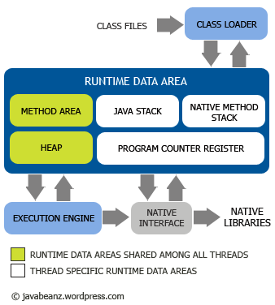

# 内存模型

这张图是我见过的最能描述JVM内存模型的图，JVM包括两个子系统和两个组件。两个子系统为：class loader（类装载）、Execution engine（执行引擎）；两个组件为：Runtime data area（运行时数据区）、Native interface(本地接口)

Class loader功能：根据给定的全限定名类名(如：java.lang.Object)来装载class文件到Runtime data area中的method area。程序中可以extends java.lang.ClassLoader类来实现自己的Class loader。

Execution engine功能：执行classes中的指令。任何JVM specification实现(JDK)的核心都是Execution engine，不同的JDK例如Sun的JDK和IBM的JDK好坏主要就取决于他们各自实现的Execution engine的好坏。

Native interface组件：与native libraries交互，是其它编程语言交互的接口。当调用native方法的时候，就进入了一个全新的并且不再受虚拟机限制的世界，所以也很容易出现JVM无法控制的native heap OutOfMemory。

Runtime Data Area组件：这就是我们常说的JVM的内存。主要分为五个部分：
1、Heap (堆)：一个Java虚拟实例中只存在一个堆空间
2、Method Area(方法区域)：被装载的class的信息存储在Method area的内存中。当虚拟机装载某个类型时，它使用类装载器定位相应的class文件，然后读入这个class文件内容并把它传输到虚拟机中。
3、Java Stack(java的栈)：虚拟机只会直接对Java stack执行两种操作：以帧为单位的压栈或出栈
4、Program Counter(程序计数器)：每一个线程都有它自己的PC寄存器，也是该线程启动时创建的。PC寄存器的内容总是指向下一条将被执行指令的饿地址，这里的地址可以是一个本地指针，也可以是在方法区中相对应于该方法起始指令的偏移量。
5、Native method stack(本地方法栈)：保存native方法进入区域的地址

以上五部分只有Heap和Method Area是被所有线程的共享使用的；而Java stack, Program counter 和Native method stack是以线程为粒度的，每个线程独自拥有自己的部分。

（转载本站文章请注明作者和出处 JavaRanger – javaranger.com ，请勿用于任何商业用途）

本文链接: http://www.javaranger.com/archives/462 