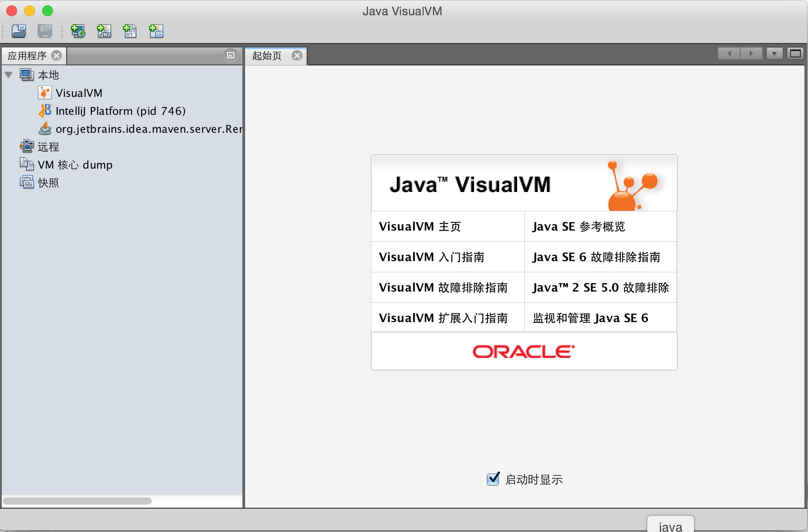
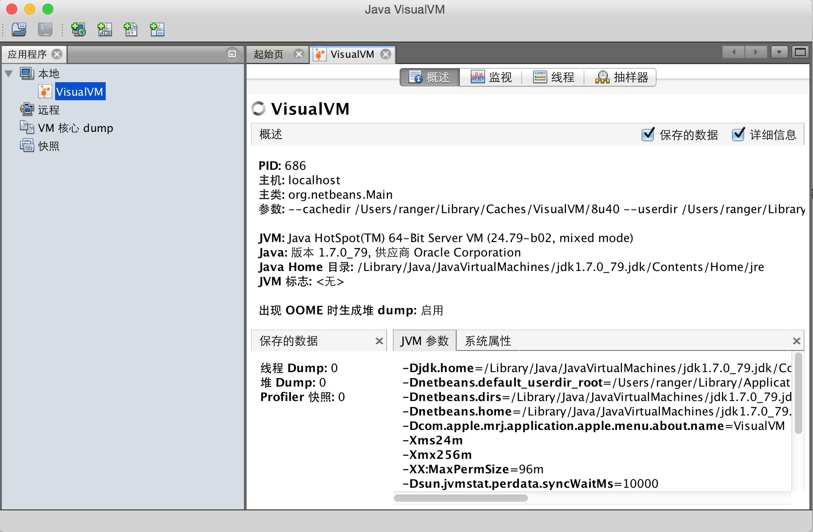
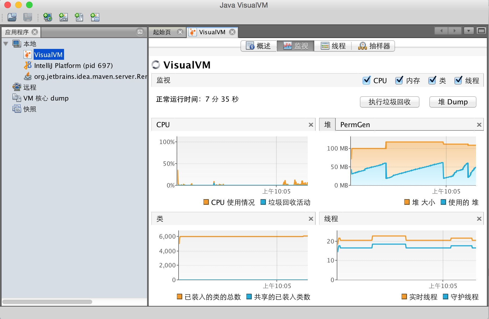
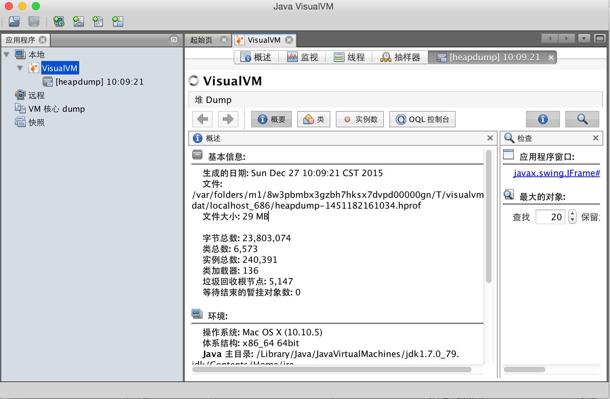
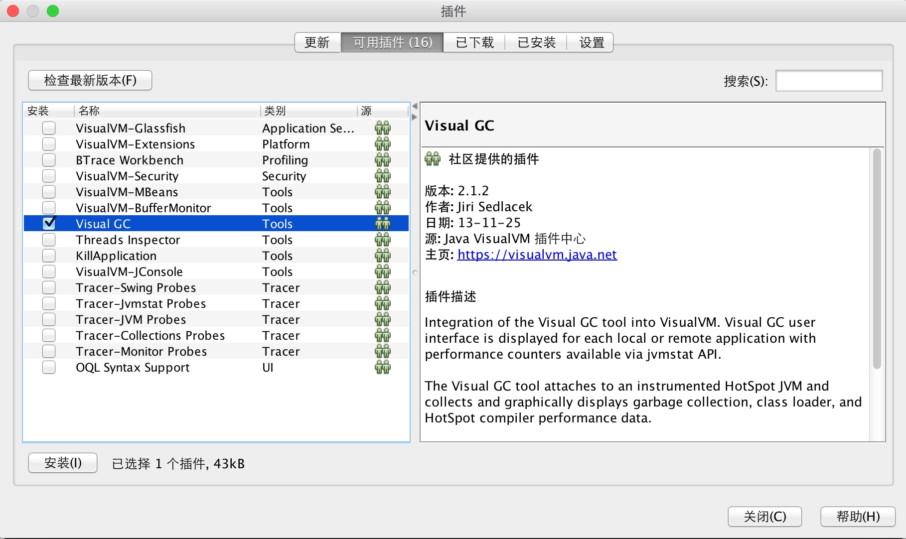
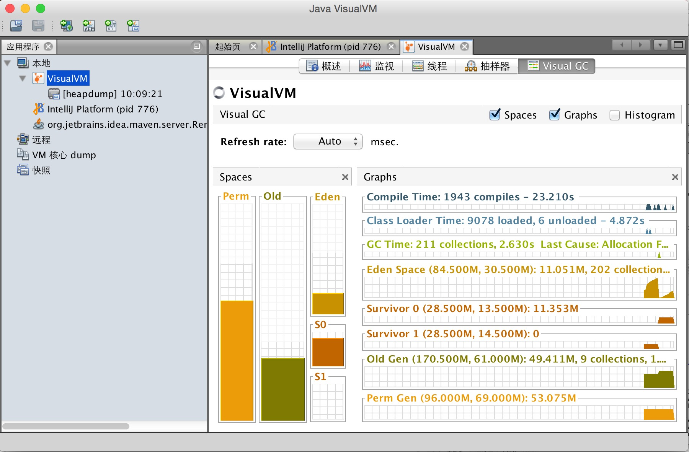

# VisualVM

## 简介
VisualVM 提供在运行的 Java 应用程序的详细信息。在 VisualVM 的图形用户界面中可以方便、快捷地查看多个 Java 应用程序的相关信息。因为JDK自带该工具，且属于免费软件，我们对java应用程序进行简单的监控分析时直接用该工具，当然如果有更复杂、更专业的监控分析需求，则最好选择商用软件。

## 使用
JDK1.6u7以后版本已携带该工具，如果你安装的JDK并未携带该工具，读者可从https://visualvm.java.net 下载，直接终端中输入jvisualvm回车或进入jdk的bin目录后输入命令即可打开，打开界面如下所示：

在左侧的“应用程序”窗口中，可以快速查看本地和远程 JVM 上运行的 Java 应用程序。接下来我们比照命令行工具简单操作一下。

1. 可查看JVM进程及进程配置、环境等相关信息，功能类jps、jinfo命令行。
这里我们就看viaualvm的一些信息，应用程序-本地栏下出现一个ViaualVM的节点，我们双击这个节点，进入以下界面：
从该界面概述选项卡里我们可以查看进程pid、JVM参数等信息。

2. 可查看应用程序内存、CPU、堆、方法区、线程等信息，功能类jstat、jstack。
 
我们点击“监视”、“线程”选项卡可直观地查看CPU、内存、类、线程、垃圾回收情况等信息。如下图所示：

3. 生成Dump、分析Dump、生成快照等，功能类jmap、jhat。
 
右键单击应用程序节点将打开弹出式菜单，从该弹出式菜单中可以生成线程 dump 或堆 dump。生成dump将扩展到应用程序节点下，如下两张图所示：
 

4. 其它功能及功能扩展。
 
我们可以在应用程序的Profiler选项卡下对cup和内存的性能进行分析。
 
VisualVM还可以很方便地扩展功能，大家可以点击工具菜单，进入插件界面，点击可用插件，然后就可以对其功能进行扩展了，如下图所示：

这里我们下载安装Visual GC。下载安装成功后重新打开应用程序节点VisualVM，我们可以看到界面中多了一个Visual GC的选项卡，打开后入下图所示：
 

 